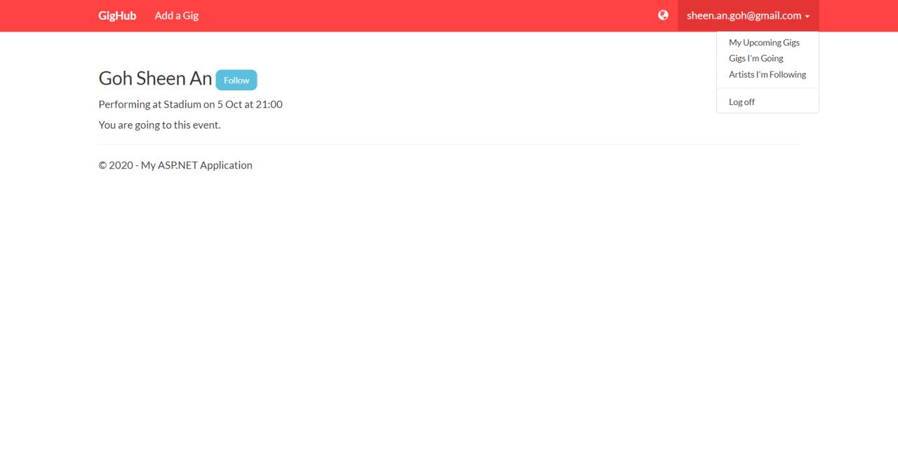

# Project Title - GigHub

A Project that is built using ASP.NET MVC.

This is an example af an ASP.NET MVC application, following the tutorial of pluralsight "Become a Full-stack.NET Developer" by Mosh Hamedani

The project incorporates the following:

- Domain Driven Design
- Clean Architecture
- Unit Testing, Integration Testing
- Repository Pattern and Unit of Work
- OOP Principles

## How to run the project

- Have Visual Studio 2015, Visual Studio 2017 or Visual Studio 2019 installed
- Before running the project, ensure the nuget packages are restored
- Run the project with F5 (Ensure Migration is completed, can use EF commands : Update-Database)

### Live-Preview

Visit this link (https://gighub20200115024236.azurewebsites.net/) for a live preview of the application.